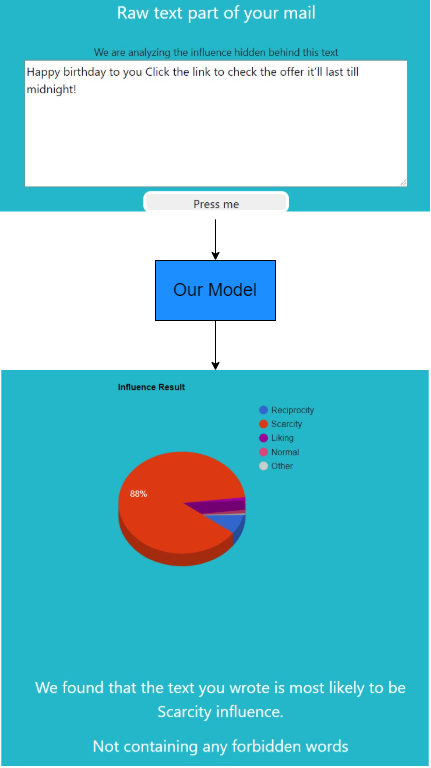

# Phishing_detection-influence_analysis

<h2>What is this? and why this is relevant?</h2>
Phishing is a common tactic used by cybercriminals to steal personal and financial information from people. Phishing scams often take the form of an email or a bunch of text that influences people and pretends to be someone they are not, such as your bank or anything you will want to check in. It’s an important topic because, to be honest, the world is becoming more dangerous in the digital market every single day and millions of people are getting manipulated by these phishing activities and losing everything from their money to personal details. So, the basic approach is to make a web app where everything related to phishing will be there so a user can easily detect any mail, link or paragraph they are getting and can see whether it’s fake or real

## How to run: 
* `git clone https://github.com/starboi2000/Phishing_detection-influence_analysis.git`
* `cd Full - App && mkdir contents`
* Download all the models and the topic_blacklist.txt from [drive](https://drive.google.com/drive/folders/1djyMa2-V-7HJfeHj17fdNeLvmmi0dE9K?usp=sharing)
* Put all the models and the files in that contents folder
* `pip install -r requirements.txt`
* Run `python app.py`

    
&nbsp; &nbsp; &nbsp; &nbsp;

                                                                 

While running the app.py, you might incur a warning if you run it in a CPU in the above picture you can see it. If you have a GPU, then the processes in the app will be much faster. After running this app you will get "http://127.0.0.1:5000/" link where you can run the app on your browser 

## Our Result:
We have used urlexpander to expand the shortened urls(for our model to classify properly), validate_email to check whether the email id is safe or not, and also our influence detection model showed great prediction overall. And we have made our dataset using real-time advertisements and scraping twitter of different big companies. overall we got a satisfactory result in each cases.

For evaluating the email id classifier we collected many email ids and it worked perfectly fine. Here’s one example with the real mail id of Flipkart

    
&nbsp; &nbsp; &nbsp; &nbsp;

Now changing ‘k’ with ‘c’

    
&nbsp; &nbsp; &nbsp; &nbsp;

Here we can see this model is giving the right prediction as the email id is not safe
 

After that Checked the Twitter model, it’s working fine for a given twitter id.
Example of this app is we can see in below, where I scraped my own twitter account and I have uploaded 2 Google form in my account, so we can see the results here how it can detect Google form also and if you click any link it’ll show the questions has been asked there and any question is asking forbidden information or not, and if the twitter id contains all normal links it'll directly detect for each link is Phishing or not

 

    
&nbsp; &nbsp; &nbsp; &nbsp;

Then fine-tune the Pre-Trained BERT model for the influence analysis. Main focus was to check how a different learning rate changes the performance of a model for a particular dataset so keep the model same and used different learning rate. Trained the model with learning rate 0.0001 until 400 epochs, got the best accuracy at 365th number of 92.46% with the loss of 0.2636, saved the best one. you can see the accuracy and the loss below

    
&nbsp; &nbsp; &nbsp; &nbsp;
    

Below you can see how we check the influence of a text. Our model replies with the probability of each influence and how much percentage of that sentence is containing  which influence because in our research we observed that maximum sentences are containing more than one type of influence so for those it’s hard for even human to decide which one is the actually correct one so with the percentage it’ll be easy for an user to understand the sentence and what its containing. From this research we have made a list of words that are basically there if the sentence is forbidden so this model will inform the user about the influence and with that it will notice whether it’s containing any forbidden words or not. you can check the forbidden list topic_blacklist.txt in the model link which we already put in the above lines 
Below you can see one Real – Life example and how this model is reacting.

    
&nbsp; &nbsp; &nbsp; &nbsp;

                                                                
For the video expalnation of how a user can use this app [click here](https://drive.google.com/file/d/1iqKwNJJeyNwY4iKqKBhoBIu04w2lcNyK/view?usp=sharing)
                                                                
## Understand the code:
We have uploaded all the codes in a simpler ipynb(jupyter notebook) format to anyone to understand clearly you can access that by [clicking here](https://github.com/starboi2000/Phishing_detection-influence_analysis/tree/main/All%20Codes%20in%20ipynb%20to%20understand%20better)

## Clear view:
For understand the algorithm properly and to understand how the research worked [check this](https://github.com/starboi2000/Phishing_detection-influence_analysis/blob/main/CDAC%20Project%20Report.pdf)
